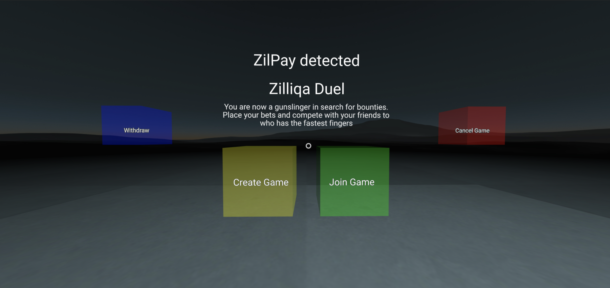

# Zilliqa Duel (WORK IN PROGRESS)

Zilliqa Duel is a gunslinger game. Compete with friends to see who has the fastest finger.

# How to play
1. Create a game, you will need to stake ZILs (min 100 ZILs at the present moment) to start a game room. This stake will go into a pot that will eventually go to the winner. Take note of the game room number.

1. You may cancel the game anytime prior to a friend joining the room.

1. Ask a friend to join the game room number. Your friend must stake the same amount of ZILs to join the game. Once the transaction is registered on the blockchain the game will start. So be ready!

1. Shoot your friend as quickly as possible. The oracles (currently a single server) observing the game will evaluate who shot and hit first. The winner will take the entire pot.

1. Withdraw your winnings should you win the game!

1. Note that the game creator will tax 10% upon every staking action.

# Alternative Use Cases
1. Suggested by Chung Tin Long Jonathan "You can use this to settle Asians fighting to pay the bill"